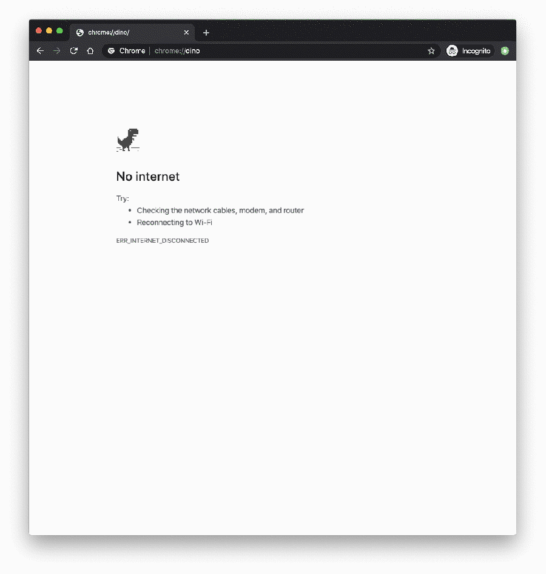
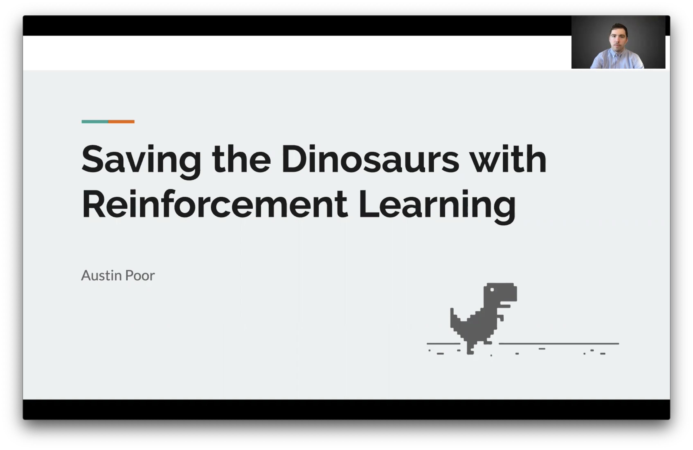
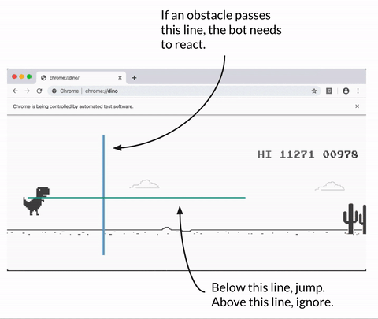

# Chrome Dino-Game Solver

_by Austin Poor_

  

This is the code for my fifth project for the [Metis Data Science Bootcamp](https://www.thisismetis.com/data-science-bootcamps).

For my project, I wanted to get some experience with Reinforcement Learning, so I chose to build a bot to play Chrome's _No-Internet Dinosaur Game_.

In case you aren't familiar, Chrome has a [_hidden dinosaur game_](https://en.wikipedia.org/wiki/List_of_Google_Easter_eggs#Chrome), that can be accessed (if you're using Chrome) at the following link: [chrome://dino](chrome://dino). To start the game, press either the _space bar_ or the _up arrow_. To play the game, use the _up arrow_ (or _space bar_) to _jump_ and the _down arrow_ to duck. You must dodge cacti and pterodactyls for as long as possible.

  

Click the thumbnail above for a video of my presentation.

I've also included a copy of the presentation deck, [here](apoor_chromeDinoGameSolver_presentation.pdf).

***

## Results

I ended up building a _heursitic bot_ (which follows pre-defined rules for choosing actions) as well as a _reinforcement learning bot_ (which learns a policy as it plays).

  

The _Heuristic Bot_ was able to get a high score of just over `16,000`. For comparison, when I play my high score is about `2,500`.

  

The _Reinforcement Learning Bot_ was only able to get a high score of `1,300`, but with a lot variation in the scores. The RL bot seemed to be able to find a good policy for dealing with the cacti but it seemed to have a hard time learning to get past the pterodactyls, which come later on in the game.

In order for the RL bot to be able to play as well as the heuristic bot, it would likely need many more iterations of training – which are especially hard given the time and memory overhead of playing the game in real-time with Chrome and Selenium.

***

## Navigating the Repo

In order to play the game, I used selenium with `ChromeDriver 80.0.3987.106`.

The file [dino_solve_jump_threshold.py](dino_solve_jump_threshold.py) is for creating the _heuristic bot_, using grid search over the thresholds.

The file [dino_solver_deepQ.py](dino_solver_deepQ.py) is for creating the deepQ bot. (The file `dino_solver_deepQ.py` also references the file [generate_data.py](generate_data.py), for creating fake data as a way of pretraining the rl model.)

The folder `threshold_plots/` has heatmaps that I created with `dino_solve_jump_threshold.py` to show what hyperparameter combinations lead to the best results.

